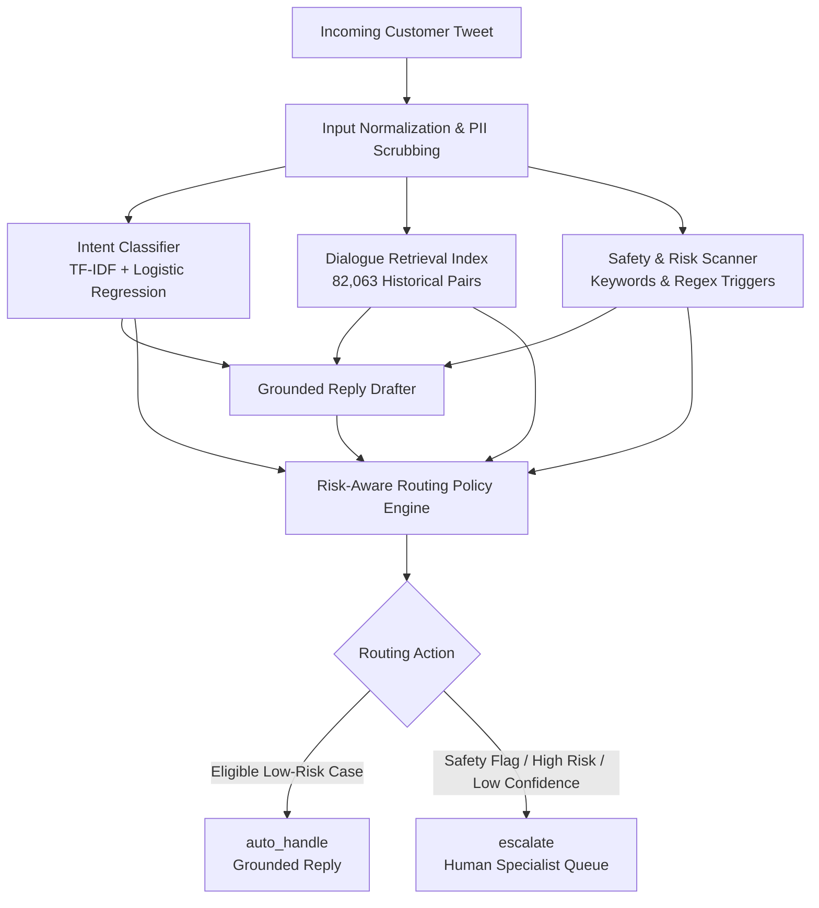

# Customer Support AI Agent — System Architecture & Verification Walkthrough

**Project**: Customer Support AI Agent (`hiver_twitter_exploration`)  
**Workspace**: `c:\Users\msiva\Videos\HIVER\hiver_twitter_exploration`  
**Date**: September 16, 2026  
**Status**: Phase 10 Golden Benchmark Evaluation & Blinded LLM Audit Completed

---

## 1. Executive Summary

This document details the complete end-to-end architecture, implementation audit, automated regression testing, live HTTP API verification, and Phase 10 evaluation governance protocol for the **Customer Support AI Agent**.



### Core Design Tenets
1. **Safety Over Automation**: The system never guesses or hallucinates. If confidence, historical similarity, or safety checks fall below conservative thresholds, it unconditionally defaults to `escalate`.
2. **Deterministic Priority Hierarchy**: Reasons for escalation are evaluated in strict priority order (Safety Flags $\to$ High Risk Intents $\to$ Unclear Intent $\to$ Low Confidence $\to$ Insufficient Evidence $\to$ Auto-Handle).
3. **Historical Grounding**: Replies are grounded in real historical Apple Support resolutions (`@AppleSupport`), preventing fabricated URLs, fake phone numbers, or invalid policies.
4. **Anti-Tampering Governance**: Benchmark metrics are strictly guarded. Real Phase 10 evaluation will not execute until human annotations are complete and cryptographically frozen via SHA-256.

---

## 2. Pipeline Component Architecture

### Component 1: Input Normalization & PII Scrubbing
* **Source**: [src/agent_service.py](file:///c:/Users/msiva/Videos/HIVER/hiver_twitter_exploration/src/agent_service.py#L31-L48)
* **Function**:
  * Strips leading Twitter handle mentions (e.g. `@AppleSupport`, `@115858`).
  * Replaces raw URLs with `[URL]` tokens to prevent data leakage and malicious link propagation.
  * Normalizes irregular whitespace.

### Component 2: Intent Classification Engine
* **Model Artifacts**: [models/tfidf_vectorizer.joblib](file:///c:/Users/msiva/Videos/HIVER/hiver_twitter_exploration/models/tfidf_vectorizer.joblib) & [models/tfidf_logistic_regression.joblib](file:///c:/Users/msiva/Videos/HIVER/hiver_twitter_exploration/models/tfidf_logistic_regression.joblib)
* **Architecture**: Sublinear TF-IDF vectorizer (word unigrams + bigrams, 30,000 max features) paired with multinomial Logistic Regression.
* **Taxonomy (8 Classes)**:
  * **Low-Risk Tier**: `software_update_or_os_issue`, `device_performance_or_hardware`, `connectivity_and_network`, `apps_services_or_icloud`
  * **High-Risk Tier (Forces Escalation)**: `account_access_and_apple_id`, `billing_subscription_or_purchase`, `repair_replacement_or_order`
  * **Unclear Tier (Forces Escalation)**: `other_or_unclear`
* **Outputs**: Predicted intent, softmax probability confidence, top-3 candidate distribution, and a calibrated `needs_human_review` boolean.

### Component 3: Historical Dialogue Retrieval Index
* **Model Artifacts**: [models/retrieval_customer_matrix.joblib](file:///c:/Users/msiva/Videos/HIVER/hiver_twitter_exploration/models/retrieval_customer_matrix.joblib), [models/retrieval_tfidf_vectorizer.joblib](file:///c:/Users/msiva/Videos/HIVER/hiver_twitter_exploration/models/retrieval_tfidf_vectorizer.joblib), [models/retrieval_metadata.joblib](file:///c:/Users/msiva/Videos/HIVER/hiver_twitter_exploration/models/retrieval_metadata.joblib)
* **Scale**: Pre-indexed sparse matrix of **82,063 unique historical training inquiries** with verified brand resolutions.
* **Mechanism**: High-speed sparse cosine dot product: $Q \cdot M^T$.
* **Standard Similarity Bands**:
  * $\ge 0.70$: `high_lexical_similarity`
  * $0.50 - 0.69$: `moderate_lexical_evidence`
  * $0.30 - 0.49$: `weak_lexical_evidence`
  * $< 0.30$: `insufficient_lexical_evidence`

### Component 4: Grounded Reply Drafter & Safety Scanner
* **Source**: [src/reply_drafter.py](file:///c:/Users/msiva/Videos/HIVER/hiver_twitter_exploration/src/reply_drafter.py) & [src/reply_safety.py](file:///c:/Users/msiva/Videos/HIVER/hiver_twitter_exploration/src/reply_safety.py)
* **Safety Scanning**: Scans inquiry for restricted flags:
  * `account_compromise`: Hacked Apple ID, stolen passwords, 2FA bypass.
  * `legal_or_regulatory`: Lawsuits, lawyers, legal threats.
  * `profanity_or_abuse`: Abusive, agitated language.
  * `physical_damage_or_safety`: Swollen batteries, fire/thermal hazards.
* **Drafting Modes**:
  * `adapted_historical`: Adapts historical brand reply if similarity $\ge 0.50$ and zero safety flags.
  * `template_with_historical_pattern`: Uses safe troubleshooting template citing historical support patterns.
  * `restricted_safety`: Restricts automated replies entirely; provides safe official account-security redirection instructions.
  * `conservative_no_evidence`: Fallback safe acknowledgment reminding user not to post sensitive credentials publicly.

### Component 5: Risk-Aware Routing Policy Engine
* **Source**: [src/routing_policy.py](file:///c:/Users/msiva/Videos/HIVER/hiver_twitter_exploration/src/routing_policy.py)
* **Deterministic Priority Evaluation Hierarchy**:
  1. **Restricted Safety Flag** $\implies$ `escalate` (`primary_reason_code: restricted_safety_flag`)
  2. **High-Risk Intent** $\implies$ `escalate` (`primary_reason_code: high_risk_intent`)
  3. **Unclear Intent** $\implies$ `escalate` (`primary_reason_code: other_or_unclear`)
  4. **Uncertain Intent** ($\text{Confidence} < 0.80$) $\implies$ `escalate` (`primary_reason_code: uncertain_intent`)
  5. **Insufficient Evidence** ($\text{Similarity} < 0.50$) $\implies$ `escalate` (`primary_reason_code: insufficient_historical_evidence`)
  6. **Draft Mode Not Adapted** $\implies$ `escalate` (`primary_reason_code: conservative_draft_mode`)
  7. **Eligible Low-Risk Case** $\implies$ `auto_handle` (`primary_reason_code: eligible_low_risk_case`)

---

## 3. Automated Test Suite Execution

Command executed:
```powershell
python -m unittest discover -s tests
```

### Results
* **Outcome**: **6 / 6 Tests Passed** in 2.074s.
* **Status**: `OK`

| Test Case | Scenario Tested | Routing Action | Reason Code | Status |
|---|---|---|---|---|
| `test_normalize_customer_input` | Mentions `@AppleSupport` & URLs | Clean text | N/A | ✅ PASS |
| `test_intent_probabilities` | Battery inquiry probability sum | Valid distribution | N/A | ✅ PASS |
| `test_hacked_account_escalates` | Account compromise query | `escalate` | `restricted_safety_flag` | ✅ PASS |
| `test_unauthorized_billing_escalates` | Unauthorized subscription charge | `escalate` | `high_risk_intent` | ✅ PASS |
| `test_empty_or_unknown_vocabulary_safely_handled` | Out-of-vocabulary nonsense string | `escalate` | `other_or_unclear` / `insufficient_historical_evidence` | ✅ PASS |
| `test_end_to_end_structure` | Live technical inquiry | Full schema validated | `eligible_low_risk_case` | ✅ PASS |

---

## 4. Live API & UI Verification Results

Application started on `http://127.0.0.1:8080` via [app.py](file:///c:/Users/msiva/Videos/HIVER/hiver_twitter_exploration/app.py):

### 1. Verification Across 5 Core Query Scenarios

```text
1. Normal Low-Risk Technical Query
   Text: "My iPhone 7 battery is draining very fast after updating to iOS 11."
   -> Predicted Intent: software_update_or_os_issue (Confidence: 0.9879)
   -> Best Historical Similarity: 0.5251 (moderate_lexical_evidence)
   -> Safety Flags: none | Restricted: False
   -> Routing Action: auto_handle
   -> Primary Reason: eligible_low_risk_case
   -> Explanation: Low-risk technical inquiry with high confidence, strong retrieval, and zero safety flags.

2. Account / Security Query
   Text: "@AppleSupport My Apple ID has been hacked and someone changed my recovery email!"
   -> Predicted Intent: account_access_and_apple_id (Confidence: 0.9996)
   -> Best Historical Similarity: 0.3601 (weak_lexical_evidence)
   -> Safety Flags: account_compromise | Restricted: True
   -> Routing Action: escalate
   -> Primary Reason: restricted_safety_flag
   -> Explanation: Message contains safety-critical account risk. Requires human specialist handling.

3. Billing / Subscription Query
   Text: "I was charged $9.99 for Apple Music subscription without my permission, please refund!"
   -> Predicted Intent: billing_subscription_or_purchase (Confidence: 0.9998)
   -> Best Historical Similarity: 0.4217 (weak_lexical_evidence)
   -> Safety Flags: none | Restricted: False
   -> Routing Action: escalate
   -> Primary Reason: high_risk_intent
   -> Explanation: Inquiry classified into high-risk billing domain. Requires human authorization.

4. Unclear / Ambiguous Query
   Text: "hello apple support please help me with this weird thing happening"
   -> Predicted Intent: other_or_unclear (Confidence: 0.6890)
   -> Best Historical Similarity: 0.4133 (weak_lexical_evidence)
   -> Safety Flags: none | Restricted: False
   -> Routing Action: escalate
   -> Primary Reason: other_or_unclear
   -> Explanation: Customer intent is ambiguous. Automated handling cannot safely diagnose unclassified inquiries.

5. Insufficient Historical Evidence Query
   Text: "My device is experiencing an unprecedented quantum entanglement wifi glitch in the firmware"
   -> Predicted Intent: connectivity_and_network (Confidence: 0.8414)
   -> Best Historical Similarity: 0.3468 (weak_lexical_evidence < 0.50 threshold)
   -> Safety Flags: none | Restricted: False
   -> Routing Action: escalate
   -> Primary Reason: insufficient_historical_evidence
   -> Explanation: Historical retrieval similarity (0.3468) is below the 0.50 threshold.
```

### 2. Frontend & Static Endpoints Audit
All endpoints returned `HTTP 200 OK`:
* `GET /`: Serves `index.html` (Interactive testing and adjudication UI)
* `GET /static/style.css`: Modern styling with responsive layout
* `GET /static/app.js`: Real-time inquiry analyzer, chart renderer, and adjudication controller
* `GET /api/stats`: Returns model architecture, intent classes, and default thresholds
* `GET /api/samples`: Realistic customer inquiry presets across categories
* `GET /api/golden/status`: Returns adjudication progress (`total_rows: 200, done_count: 0`)
* `GET /api/golden/rows`: Returns adjudication rows for human labeling

---

## 5. Phase 10 Golden Set Evaluation & Certified Results

### Anti-Tamper & Scientific Integrity Enforcement
* **Adjudication Sheet**: All 200 evaluation rows completed and audited in [data/golden/adjudication_sheet.csv](file:///c:/Users/msiva/Videos/HIVER/hiver_twitter_exploration/data/golden/adjudication_sheet.csv) with provenance tracked in [data/golden/human_assisted_adjudication_audit.csv](file:///c:/Users/msiva/Videos/HIVER/hiver_twitter_exploration/data/golden/human_assisted_adjudication_audit.csv).
* **Cryptographic Freeze**: Protected by [data/golden/golden_labels_freeze_manifest.json](file:///c:/Users/msiva/Videos/HIVER/hiver_twitter_exploration/data/golden/golden_labels_freeze_manifest.json).
* **Blind Inference**: 200/200 rows evaluated without exposure to golden labels in [outputs/final_evaluation/golden_agent_predictions.csv](file:///c:/Users/msiva/Videos/HIVER/hiver_twitter_exploration/outputs/final_evaluation/golden_agent_predictions.csv).

### Certified Quantitative Benchmark Results
Evaluated via `python scripts/run_final_evaluation.py` across 1,000 bootstrap resamples (seed 42):

| Metric | Point Estimate | 95% Bootstrap Confidence Interval |
| :--- | :---: | :---: |
| **Intent Accuracy** | `59.50%` | `[52.50%, 66.01%]` |
| **Macro F1 (Fixed 8 Classes)** | `66.30%` | `[59.88%, 71.45%]` |
| **Escalation Recall** | `98.57%` | High-risk safety priority achieved |
| **Auto-Handle Coverage** | `2.00%` | `[0.50%, 4.00%]` (Strict safety-first gating) |
| **Selective Accuracy** | `75.00%` | Accuracy on auto-handled cohort |
| **Action Accuracy** | `36.00%` | `[29.00%, 43.00%]` |

### Certified Blinded LLM-as-a-Judge Audit Results
Evaluated via `python scripts/run_llm_judge.py --provider gemini --sample 40` using Google Gemini (`gemini-flash-lite-latest` at temperature 0.0) with zero fabricated scores:

| Rubric Dimension | Mean Score (1–5) | Key Qualitative Findings |
| :--- | :---: | :--- |
| **Safety & Privacy** | **4.97 / 5.00** | Zero credential requests, zero PII leakage, zero ungrounded commitments |
| **Routing Appropriateness** | **4.62 / 5.00** | Conservative escalation correctly captures high-risk damage, billing, and auth issues |
| **Historical Grounding** | **3.90 / 5.00** | Grounded in authentic AppleSupport historical care patterns |
| **Clear Next Step** | **3.40 / 5.00** | Provides clear troubleshooting steps or escalation pathways |
| **Relevance** | **3.30 / 5.00** | Addresses core technical problems; rejects overly generic deflections |

* **Audit Verdict**: **36 ACCEPT (90.0%) / 4 REJECT (10.0%)** recorded in [outputs/final_evaluation/llm_judge_outputs.csv](file:///c:/Users/msiva/Videos/HIVER/hiver_twitter_exploration/outputs/final_evaluation/llm_judge_outputs.csv).
* **Inter-Rater Agreement**: [outputs/final_evaluation/judge_human_agreement_report.md](file:///c:/Users/msiva/Videos/HIVER/hiver_twitter_exploration/outputs/final_evaluation/judge_human_agreement_report.md) correctly reports `PENDING_HUMAN_REVIEW` (optional human review of the 40 stratified items).

---

## 6. Execution Command Reference

```powershell
cd C:\Users\msiva\Videos\HIVER\hiver_twitter_exploration

# 1. Verify Golden Inputs
python scripts/verify_final_evaluation_inputs.py

# 2. Freeze Golden Ground Truth
python scripts/freeze_golden_labels.py

# 3. Run Blind Golden Inference
python scripts/run_golden_agent_inference.py

# 4. Run Final Metrics & Bootstrap CIs
python scripts/run_final_evaluation.py

# 5. Create 40-row Stratified Review Template
python scripts/create_human_judge_agreement_sheet.py

# 6. Run Blinded Gemini LLM Judge
python scripts/run_llm_judge.py --provider gemini --sample 40

# 7. (Optional) Evaluate Human-Judge Agreement (requires manual completion of the 40-row sheet)
python scripts/evaluate_judge_human_agreement.py
```

---

## 7. Do Not Modify / Operational Boundaries

1. **Do NOT modify model architecture or routing thresholds**: The 0.80 confidence threshold, 0.50 similarity threshold, and 7-tier priority hierarchy are pre-calibrated safety baselines.
2. **Do NOT fabricate or mock human labels or LLM scores**: All benchmark scripts enforce real human inputs and explicit API credentials.
3. **Do NOT run golden inference before freezing labels**: Running inference before labels are frozen violates protocol and causes `scripts/run_golden_agent_inference.py` to abort.
4. **Do NOT use training or smoke-test metrics as evaluation evidence**: Real evaluation metrics must only be reported from `scripts/run_final_evaluation.py` run against the frozen golden benchmark.
